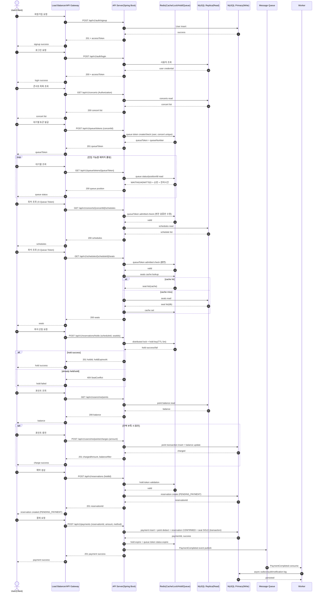

# 서비스 시퀀스 다이어그램

콘서트 예약 서비스의 인증/대기열/조회/선점/예약/결제 흐름과 인프라 구성요소(`LB/API/Redis/MySQL/MQ/Worker`)를 함께 반영한 전체 시퀀스입니다.
`X-Queue-Token`은 입장 권한/만료 검증 전용(불변)이며, 회차/좌석 선택 컨텍스트를 업데이트하지 않습니다.

```mermaid
sequenceDiagram
    autonumber
    actor U as User(Client)
    participant LB as Load Balancer/API Gateway
    participant API as API Server(Spring Boot)
    participant REDIS as Redis(Cache/Lock/Hold/Queue)
    participant RDSR as MySQL Replica(Read)
    participant RDSW as MySQL Primary(Write)
    participant MQ as Message Queue
    participant WORKER as Worker

    U->>LB: 회원가입 요청
    LB->>API: POST /api/v1/auth/signup
    API->>RDSW: User insert
    RDSW-->>API: success
    API-->>LB: 201 + accessToken
    LB-->>U: signup success

    U->>LB: 로그인 요청
    LB->>API: POST /api/v1/auth/login
    API->>RDSR: 사용자 조회
    RDSR-->>API: user credential
    API-->>LB: 200 + accessToken
    LB-->>U: login success

    U->>LB: 콘서트 목록 조회
    LB->>API: GET /api/v1/concerts (Authorization)
    API->>RDSR: concerts read
    RDSR-->>API: concert list
    API-->>LB: 200 concert list
    LB-->>U: concert list

    U->>LB: 대기열 토큰 발급
    LB->>API: POST /api/v1/queue/tokens (concertId)
    API->>REDIS: queue token create/check (user, concert unique)
    REDIS-->>API: queueToken + queueNumber
    API-->>LB: 201 queueToken
    LB-->>U: queueToken

    loop 진입 가능할 때까지 폴링
        U->>LB: 대기열 조회
        LB->>API: GET /api/v1/queue/tokens/{queueToken}
        API->>REDIS: queue status/position/ttl read
        REDIS-->>API: WAITING/ADMITTED + 순번 + 잔여시간
        API-->>LB: 200 queue position
        LB-->>U: queue status
    end

    U->>LB: 회차 조회 (X-Queue-Token)
    LB->>API: GET /api/v1/concerts/{concertId}/schedules
    API->>REDIS: queueToken admitted check (권한 검증만 수행)
    REDIS-->>API: valid
    API->>RDSR: schedules read
    RDSR-->>API: schedule list
    API-->>LB: 200 schedules
    LB-->>U: schedules

    U->>LB: 좌석 조회 (X-Queue-Token)
    LB->>API: GET /api/v1/schedules/{scheduleId}/seats
    API->>REDIS: queueToken admitted check (불변)
    REDIS-->>API: valid
    API->>REDIS: seats cache lookup
    alt cache hit
        REDIS-->>API: seat list(cache)
    else cache miss
        API->>RDSR: seats read
        RDSR-->>API: seat list(db)
        API->>REDIS: cache set
    end
    API-->>LB: 200 seats
    LB-->>U: seats

    U->>LB: 좌석 선점 요청
    LB->>API: POST /api/v1/reservations/holds (scheduleId, seatIds)
    API->>REDIS: distributed lock + hold key(TTL 5m)
    REDIS-->>API: hold success/fail
    alt hold success
        API-->>LB: 201 holdId, holdExpiresAt
        LB-->>U: hold success
    else already held/sold
        API-->>LB: 409 SeatConflict
        LB-->>U: hold failed
    end

    U->>LB: 포인트 조회
    LB->>API: GET /api/v1/users/me/points
    API->>RDSR: point balance read
    RDSR-->>API: balance
    API-->>LB: 200 balance
    LB-->>U: balance

    opt 잔액 부족 시 충전
        U->>LB: 포인트 충전
        LB->>API: POST /api/v1/users/me/points/charges (amount)
        API->>RDSW: point transaction insert + balance update
        RDSW-->>API: charged
        API-->>LB: 201 chargedAmount, balanceAfter
        LB-->>U: charge success
    end

    U->>LB: 예약 생성
    LB->>API: POST /api/v1/reservations (holdId)
    API->>REDIS: hold token validation
    REDIS-->>API: valid
    API->>RDSW: reservation create (PENDING_PAYMENT)
    RDSW-->>API: reservationId
    API-->>LB: 201 reservationId
    LB-->>U: reservation created (PENDING_PAYMENT)

    U->>LB: 결제 요청
    LB->>API: POST /api/v1/payments (reservationId, amount, method)
    API->>RDSW: payment insert + point deduct + reservation CONFIRMED + seat SOLD (transaction)
    RDSW-->>API: paymentId, success
    API->>REDIS: hold expire + queue token status expire
    API->>MQ: PaymentCompleted event publish
    API-->>LB: 201 payment success
    LB-->>U: payment success

    MQ-->>WORKER: PaymentCompleted consume
    WORKER->>RDSW: async outbox/audit/notification log
    RDSW-->>WORKER: persisted
```
