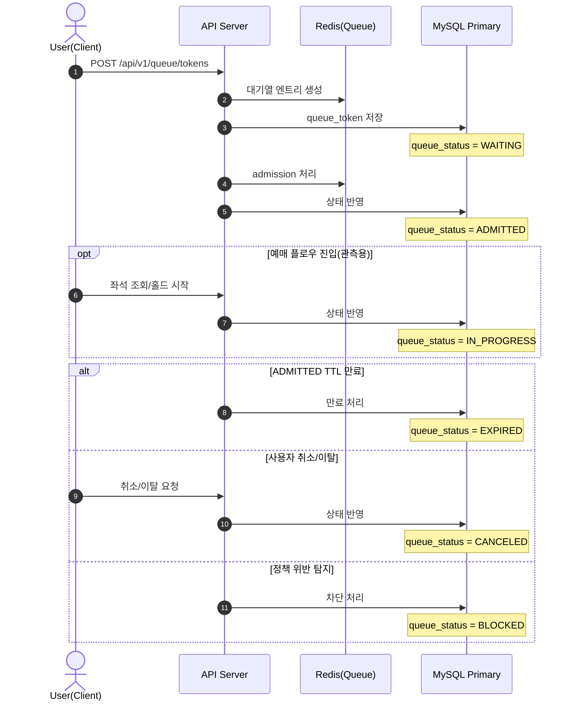
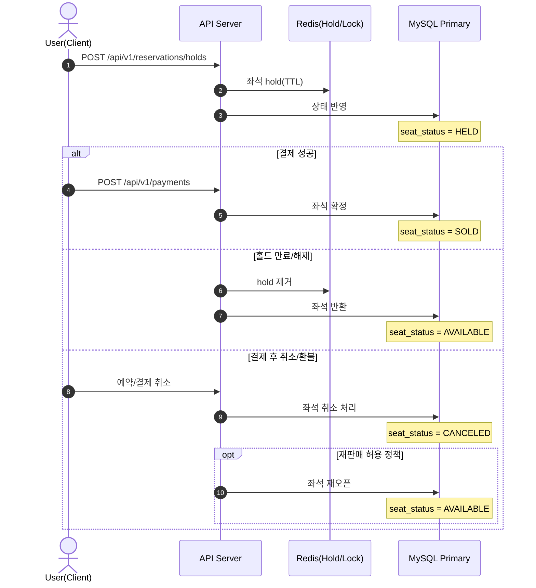
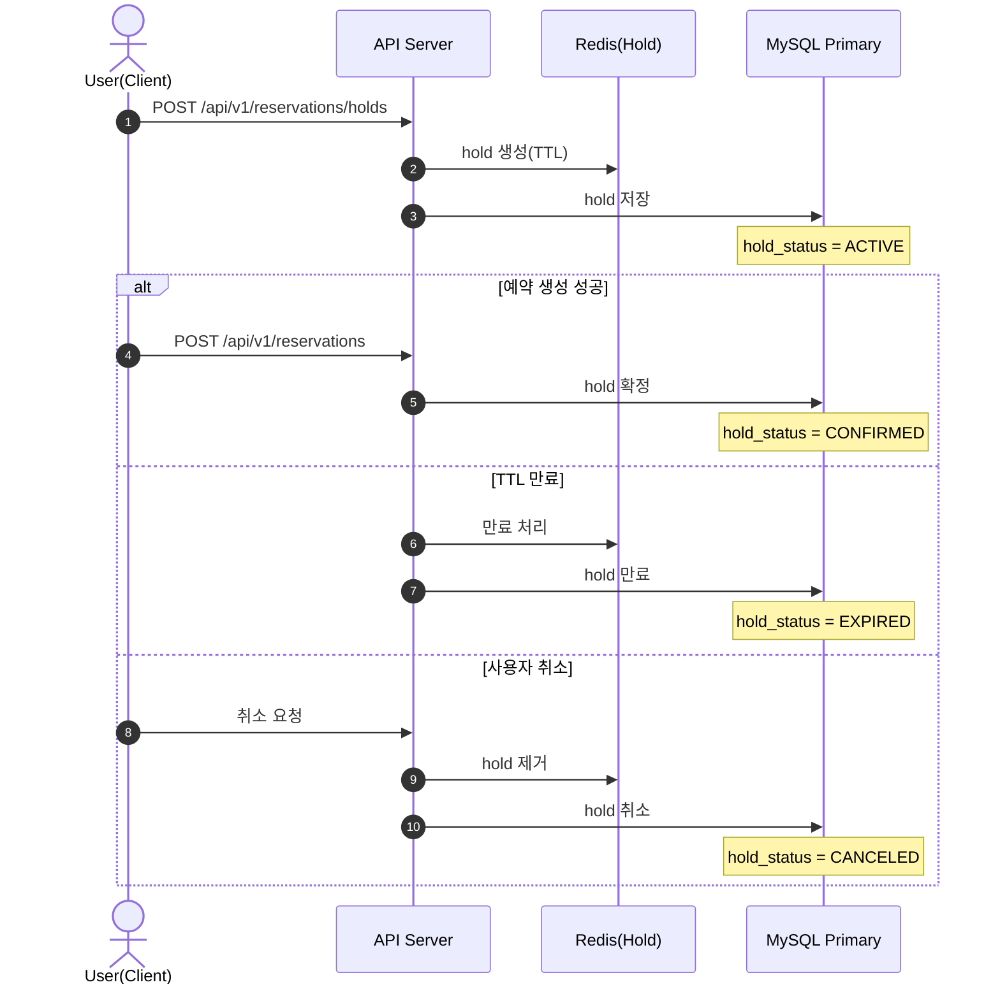
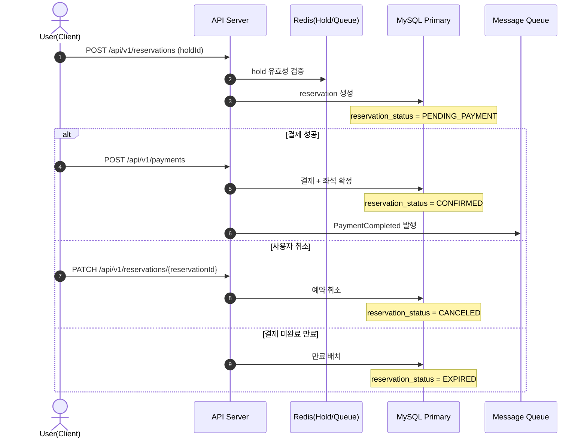
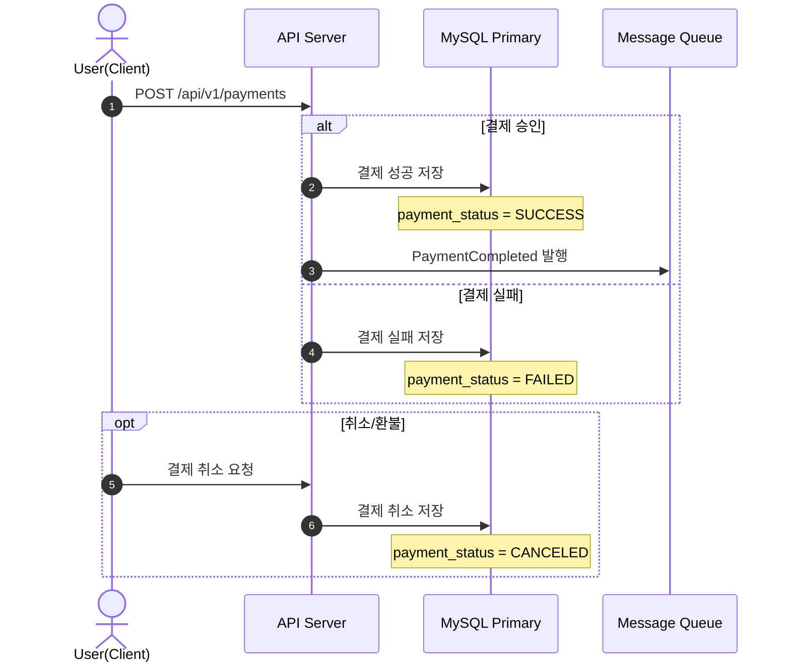

# 상태 변경 시퀀스 다이어그램

서비스의 주요 상태 종류별 상태 전이와 트리거 흐름을 정리한 문서입니다.

## 1. 대기열 토큰 상태 (`queue_tokens.queue_status`)

### 상태 전이 규칙

- `WAITING` -> `ADMITTED`: 입장권 발급
- `ADMITTED` -> `IN_PROGRESS`: 예매 플로우 진입(옵션)
- `ADMITTED` -> `EXPIRED`: 입장권 TTL 만료
- `WAITING`/`ADMITTED`/`IN_PROGRESS` -> `CANCELED`: 사용자 취소/이탈
- `*` -> `BLOCKED`: 정책 위반/봇 탐지

## 2. 좌석 상태 (`seats.seat_status`)

### 상태 전이 규칙

- `AVAILABLE` -> `HELD`: 선점 성공
- `HELD` -> `SOLD`: 결제 성공
- `HELD` -> `AVAILABLE`: 홀드 만료/해제
- `SOLD` -> `CANCELED`: 취소/환불
- `CANCELED` -> `AVAILABLE`: 재판매 정책 허용 시

## 3. 좌석 홀드 상태 (`seat_holds.hold_status`)

### 상태 전이 규칙

- `ACTIVE` -> `CONFIRMED`: 예약 생성 시 확정
- `ACTIVE` -> `EXPIRED`: hold TTL 만료
- `ACTIVE` -> `CANCELED`: 사용자 취소/이탈

## 4. 예약 상태 (`reservations.reservation_status`)

### 상태 전이 규칙

- `PENDING_PAYMENT` -> `CONFIRMED`: 결제 성공
- `PENDING_PAYMENT` -> `CANCELED`: 사용자 취소
- `PENDING_PAYMENT` -> `EXPIRED`: 결제 미완료 만료
- `CONFIRMED` -> `CANCELED`: 확정 후 취소 정책 허용 시

## 5. 결제 상태 (`payments.payment_status`)

### 상태 전이 규칙

- `SUCCESS`: 결제 승인 완료
- `FAILED`: 결제 실패
- `SUCCESS` -> `CANCELED`: 취소/환불 처리
