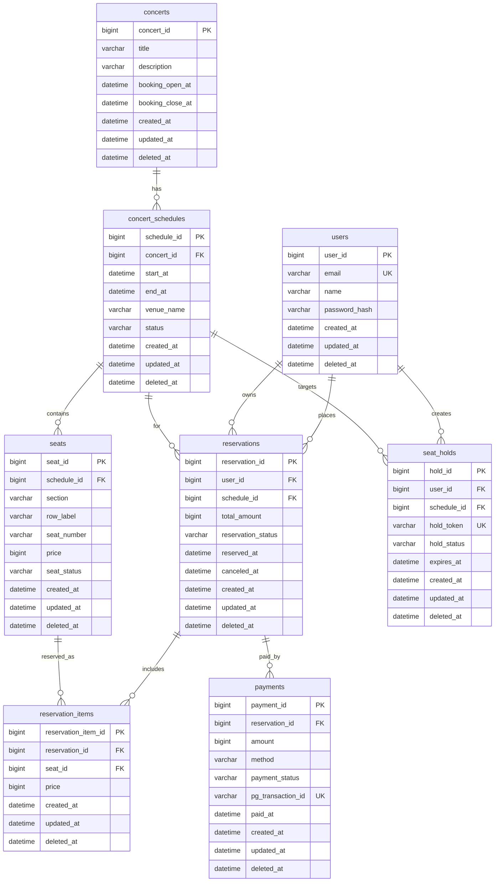

# 콘서트 예약 서비스 ERD (Step 02)

## 1. 엔터티 요약

| 엔터티 | 설명 |
| --- | --- |
| `users` | 회원 계정 |
| `concerts` | 콘서트 기본 정보 |
| `concert_schedules` | 콘서트 회차/공연 일정 |
| `seats` | 회차별 좌석 |
| `seat_holds` | 좌석 선점(임시 점유) |
| `reservations` | 예약 헤더(예약 상태/합계) |
| `reservation_items` | 예약 좌석 목록 |
| `payments` | 결제 이력 |

## 2. ER 다이어그램 (Mermaid)

## 3. 테이블 상세/제약

| 테이블 | 핵심 제약 |
| --- | --- |
| `users` | `email` UNIQUE, `deleted_at` 소프트 삭제 |
| `concert_schedules` | `concert_id` FK, `start_at < end_at` CHECK |
| `seats` | `(schedule_id, section, row_label, seat_number)` UNIQUE |
| `seat_holds` | `hold_token` UNIQUE, `expires_at` 필수 |
| `reservation_items` | `seat_id` UNIQUE (좌석 중복 예약 방지) |
| `payments` | `pg_transaction_id` UNIQUE (중복 결제 방지) |

## 4. 인덱스 후보

| 테이블 | 인덱스 | 목적 |
| --- | --- | --- |
| `users` | `idx_users_email` (`email`) | 로그인/회원 조회 |
| `concert_schedules` | `idx_schedules_concert_start` (`concert_id`, `start_at`) | 콘서트 회차 목록 |
| `seats` | `idx_seats_schedule_status` (`schedule_id`, `seat_status`) | 좌석 맵/남은 좌석 조회 |
| `seat_holds` | `idx_holds_expires_at` (`expires_at`) | 만료 선점 정리 배치 |
| `reservations` | `idx_reservations_user_created` (`user_id`, `created_at`) | 내 예약 목록 |
| `payments` | `idx_payments_reservation` (`reservation_id`) | 예약별 결제 조회 |

## 5. 상태 전이 규칙

### `seats.seat_status`

- `AVAILABLE` -> `HELD` -> `SOLD`
- `HELD` -> `AVAILABLE` (선점 만료/취소)

### `reservations.reservation_status`

- `PENDING_PAYMENT` -> `CONFIRMED`
- `PENDING_PAYMENT` -> `EXPIRED`
- `CONFIRMED` -> `CANCELED`

### `payments.payment_status`

- `READY` -> `SUCCESS`
- `READY` -> `FAILED`
- `SUCCESS` -> `CANCELED` (환불)

## 6. 동시성/정합성 메모

- 좌석 선점 시 `schedule_id + seat_id` 기준 중복 점유 방지 전략 필요
- 좌석 확정 전 선점 만료 처리(`expires_at`)를 주기적으로 정리
- 예약 확정/결제/좌석 확정은 트랜잭션 경계를 명확히 분리
- 고트래픽 구간에서는 분산락(예: Redis) 또는 DB 락 전략 검토
