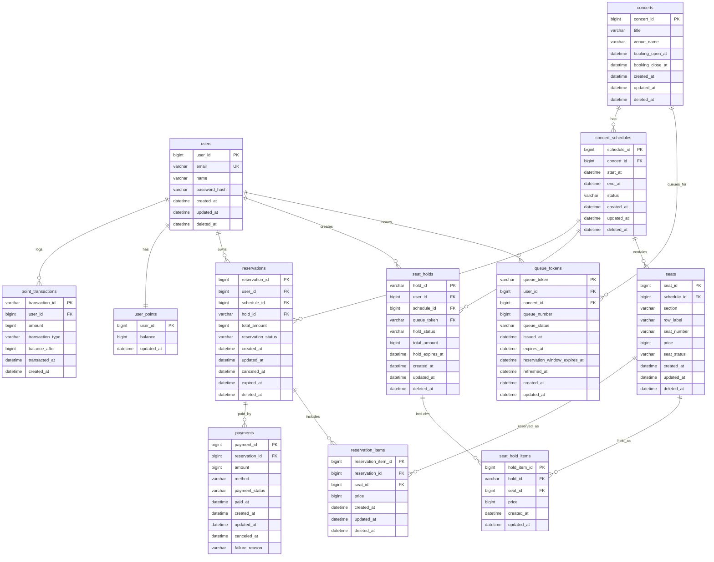

# 콘서트 예약 서비스 ERD (OpenAPI 0.1.0 기준)

기준 스펙: `docs/openapi.yaml`

## 1. 엔터티 요약

| 엔터티 | 설명 |
| --- | --- |
| `users` | 회원 계정 |
| `concerts` | 콘서트 기본 정보 |
| `concert_schedules` | 콘서트 회차 |
| `seats` | 회차별 좌석 |
| `queue_tokens` | 대기열 토큰/순번/유효시간 |
| `seat_holds` | 좌석 선점 헤더(holdId, 만료시간) |
| `seat_hold_items` | 선점 좌석 목록(다건 seatIds) |
| `reservations` | 예약 헤더 |
| `reservation_items` | 예약 좌석 목록 |
| `user_points` | 사용자 포인트 잔액 |
| `point_transactions` | 포인트 충전/사용 이력 |
| `payments` | 결제 이력 |

## 2. ER 다이어그램 (Mermaid)

## 3. OpenAPI 기반 핵심 제약

| 테이블 | 핵심 제약 |
| --- | --- |
| `users` | `email` UNIQUE |
| `queue_tokens` | `queue_token` PK, 활성 토큰 중복 방지(`user_id + concert_id` on non-terminal status: `WAITING`, `ADMITTED`, `IN_PROGRESS`) |
| `seats` | `(schedule_id, section, row_label, seat_number)` UNIQUE |
| `seat_holds` | `hold_id` PK, `hold_expires_at` 필수 |
| `seat_hold_items` | `(hold_id, seat_id)` UNIQUE |
| `reservations` | `hold_id` UNIQUE(선점 1회 확정), `reservation_status` enum |
| `reservation_items` | `seat_id` UNIQUE(동일 좌석 중복 예약 방지) |
| `user_points` | `balance >= 0` |
| `point_transactions` | `transaction_id` PK, `transaction_type` enum(CHARGE, USE, REFUND) |
| `payments` | `payment_status` enum(SUCCESS, FAILED, CANCELED) |

## 4. 인덱스 후보

| 테이블 | 인덱스 | 목적 |
| --- | --- | --- |
| `concert_schedules` | `idx_schedules_concert_start` (`concert_id`, `start_at`) | 회차 목록 조회 |
| `seats` | `idx_seats_schedule_status` (`schedule_id`, `seat_status`) | 좌석 현황 조회 |
| `queue_tokens` | `idx_queue_user_concert` (`user_id`, `concert_id`, `queue_status`) | 활성 토큰 조회/중복 방지 |
| `queue_tokens` | `idx_queue_status_number` (`concert_id`, `queue_status`, `queue_number`) | 대기 순번 처리 |
| `seat_holds` | `idx_holds_expiry` (`hold_expires_at`) | 만료 선점 정리 |
| `seat_hold_items` | `idx_hold_items_seat` (`seat_id`) | 선점 충돌 검사 |
| `reservations` | `idx_reservations_user_created` (`user_id`, `created_at`) | 내 예약 목록 |
| `point_transactions` | `idx_point_tx_user_created` (`user_id`, `created_at`) | 포인트 내역 조회 |
| `payments` | `idx_payments_reservation` (`reservation_id`) | 예약별 결제 조회 |

## 5. 상태 전이 규칙

### `queue_tokens.queue_status`

- `WAITING` -> `ADMITTED` -> `IN_PROGRESS`(옵션)
- `ADMITTED` -> `EXPIRED` (입장권 TTL 만료)
- `WAITING`/`ADMITTED` -> `CANCELED` (사용자 이탈/취소)
- `*` -> `BLOCKED` (정책 위반/차단)

### `seats.seat_status`

- `AVAILABLE` -> `HELD` -> `SOLD`
- `HELD` -> `AVAILABLE` (선점 만료/해제)
- `SOLD` -> `CANCELED` (취소/환불)
- `CANCELED` -> `AVAILABLE` (정책 허용 시 재판매)

### `seat_holds.hold_status`

- `ACTIVE` -> `CONFIRMED`
- `ACTIVE` -> `EXPIRED`
- `ACTIVE` -> `CANCELED`

### `reservations.reservation_status`

- `PENDING_PAYMENT` -> `CONFIRMED`
- `PENDING_PAYMENT` -> `CANCELED`
- `PENDING_PAYMENT` -> `EXPIRED`
- `CONFIRMED` -> `CANCELED`

### `payments.payment_status`

- `SUCCESS`
- `FAILED`
- `CANCELED`

## 6. 정합성 메모

- `CreateReservationRequest.holdId` 기반으로 예약 생성 시 `seat_holds`/`seat_hold_items`를 원자적으로 확정
- `QueueTokenHeader(X-Queue-Token)` 검증을 위해 `queue_tokens`의 `expires_at`, `queue_status`, `reservation_window_expires_at`를 함께 체크
- 결제 성공 시 예약/좌석/포인트 차감 반영을 단일 트랜잭션으로 처리
- 예약 취소 시 좌석 복구, 결제 취소, 포인트 환불(`point_transactions`)까지 보상 트랜잭션 기준 정의
- 대기열은 콘서트 단위 운영을 기본으로 하며, `queue_tokens`는 입장 권한/만료 검증만 담당하는 불변 토큰으로 관리
