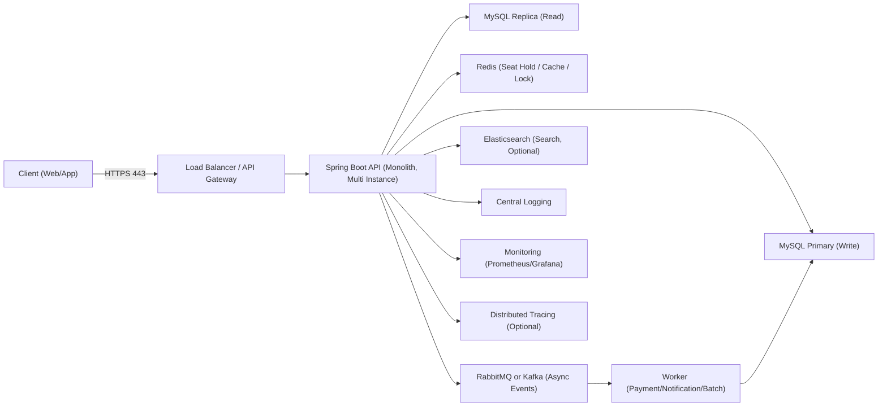

# 콘서트 예약 서비스 인프라 구성도 (Step 02)

## 1. 인프라 다이어그램 (Mermaid)

## 2. 구성 요소 설명

| 구성 요소 | 역할 |
| --- | --- |
| `Load Balancer / API Gateway` | TLS 종료, 라우팅, 인증 전처리, Rate Limit |
| `API 서버` | 인증/좌석조회/선점/예약/결제요청 등 핵심 비즈니스 처리 |
| `MySQL Primary` | 쓰기 트랜잭션 처리(예약/결제 상태 변경) |
| `MySQL Replica` | 읽기 트래픽 분산(목록/상세 조회) |
| `Redis` | 좌석 선점 TTL, 분산락, 핫데이터 캐싱 |
| `Message Queue` | 결제 후속 작업/알림/배치 비동기 처리 |
| `Worker` | 큐 소비자, 재시도/보상 처리 |
| `Elasticsearch` | 콘서트 검색/필터 성능 향상(선택) |
| `Logging/Monitoring` | 장애 탐지, 성능 병목 분석, 운영 관제 |

## 3. 핵심 요청 흐름

### 3.1 좌석 조회

1. Client -> API: 회차 좌석 조회 요청
2. API -> Redis: 캐시 조회 (있으면 즉시 응답)
3. 캐시 미스 시 API -> MySQL Replica 조회 후 Redis 갱신
4. API -> Client 응답

### 3.2 좌석 선점

1. Client -> API: 좌석 선점 요청
2. API -> Redis: 좌석 키 기반 원자적 선점(중복 방지, TTL 부여)
3. 성공 시 선점 토큰 반환, 실패 시 `409 Conflict`

### 3.3 예약 확정/결제

1. Client -> API: 예약 확정/결제 요청
2. API: 선점 토큰 유효성 검증
3. API -> MySQL Primary: 예약/결제 트랜잭션 반영
4. API -> MQ: 알림/후속 처리 이벤트 발행
5. Worker: 이벤트 처리(알림, 정산, 감사 로그 등)

## 4. 비기능 요구사항 반영 포인트

| 항목 | 설계 포인트 |
| --- | --- |
| 성능 | 좌석 조회 캐시, 읽기/쓰기 DB 분리 |
| 확장성 | API/Worker 수평 확장, MQ 기반 비동기 분리 |
| 가용성 | LB 다중 인스턴스 라우팅, DB 백업/복제 |
| 보안성 | HTTPS, JWT, 최소 권한 원칙, 내부망 분리 |
| 유지보수성 | 모듈 분리(회원/콘서트/예약/결제), 표준 로깅 |
| 비용 효율 | 초기 모놀리식 + 필요 시 점진 확장 |

## 5. 장애 대응/운영 체크

- 헬스체크 엔드포인트(`liveness`, `readiness`) 운영
- 주요 알람: API 5xx, DB 커넥션 고갈, 큐 적체, Redis 메모리 임계치
- 정기 백업 + 복구 리허설 + 장애 회고(Postmortem) 문서화
- 좌석 선점 만료 배치와 데이터 정합성 점검 배치 운영
