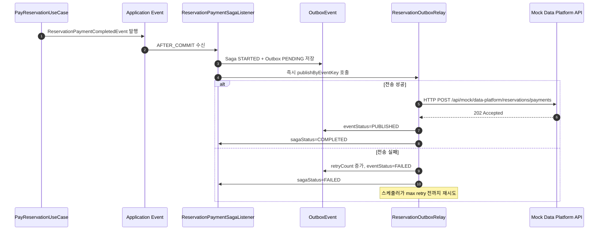

# Step 08 Transaction Diagnosis

## 1. 목표

- 현재 모놀리식 콘서트 예약 서비스를 MSA로 확장한다고 가정한다.
- 어떤 도메인 단위로 배포를 분리할지 결정한다.
- 분리 이후 발생하는 트랜잭션 한계와 해결 방안을 정리한다.

## 2. 현재 모놀리식에서 강하게 결합된 흐름

현재 결제 완료 흐름은 하나의 요청 안에서 아래 작업이 가깝게 묶여 있다.

1. 예약 상태 `PENDING_PAYMENT -> CONFIRMED`
2. 좌석 상태 `HELD -> SOLD`
3. 포인트 차감
4. 결제 이력 저장
5. 대기열 토큰 만료
6. 데이터 플랫폼 전송

모놀리식에서는 단일 DB 트랜잭션으로 상당 부분 정합성을 맞출 수 있지만, MSA에서는 각 도메인이 독립 DB를 가지므로 같은 방식이 불가능하다.

## 3. 제안하는 도메인 분리

### 3.1 배포 단위

1. `Auth/User Service`
   - 회원, 세션, 인증 토큰 관리

2. `Concert Catalog Service`
   - 콘서트, 공연장, 일정, 좌석 메타정보 조회
   - 읽기 최적화와 캐시 중심

3. `Queue Service`
   - 대기열 토큰 발급, 순번 계산, 입장 가능 여부 관리
   - Redis 중심

4. `Reservation Service`
   - 좌석 선점, hold, reservation 상태 관리
   - 예약 생성과 만료 관리의 중심 도메인

5. `Payment Service`
   - 결제 승인/실패/취소 이력
   - 외부 PG 연동 확장 지점

6. `Point Service`
   - 포인트 잔액, 차감, 환불, 거래 이력

7. `Data Platform Relay Service`
   - 예약/결제 완료 이벤트 수신 후 외부 데이터 플랫폼 적재

### 3.2 분리 기준

- `Reservation` 과 `Payment` 는 비즈니스 흐름상 이어지지만, 변경 이유가 다르다.
- `Point` 는 금액 정합성이 중요하므로 별도 원장성 서비스로 분리하는 편이 안전하다.
- `Queue` 는 트래픽 특성과 저장소(Redis)가 달라 별도 분리가 적절하다.
- `Data Platform` 전송은 실패해도 예약 확정이 롤백되면 안 되므로 독립 비동기 서비스가 적합하다.

## 4. 권장 호출 방식

### 4.1 동기 호출

- 조회성 API
  - 콘서트 목록, 회차, 좌석 조회
- 강한 사용자 상호작용이 필요한 검증
  - 대기열 입장 가능 여부 확인
  - 예약 생성 시 hold 유효성 확인

### 4.2 비동기 이벤트

- `ReservationCreated`
- `PaymentSucceeded`
- `PaymentFailed`
- `ReservationCanceled`
- `SeatHoldExpired`
- `PointDeducted`
- `PointRefunded`

핵심 상태 변경 결과는 이벤트로 흘리고, 다른 서비스는 이를 구독해 자신의 상태를 반영한다.

## 5. 분산 트랜잭션이 발생하는 지점

### 5.1 결제 성공

현재 가장 민감한 흐름이다.

1. 사용자가 결제 요청
2. `Point Service` 에서 잔액 차감
3. `Payment Service` 에서 결제 성공 저장
4. `Reservation Service` 에서 예약 확정
5. `Reservation Service` 에서 좌석 판매 확정
6. `Queue Service` 에서 대기열 토큰 만료
7. `Data Platform Relay Service` 에서 외부 전송

이 흐름은 더 이상 하나의 DB 트랜잭션으로 묶을 수 없다.

### 5.2 예약 취소 및 환불

1. 예약 취소
2. 좌석 반환
3. 결제 취소
4. 포인트 환불

여기서도 서비스 간 상태가 어긋날 수 있다.

### 5.3 홀드 만료

1. hold 만료
2. 좌석 반환
3. 미결제 예약 만료

만료 스케줄러가 여러 서비스에 걸쳐 동작하면 지연이나 중복 처리 문제가 생긴다.

## 6. 한계

### 6.1 즉시 일관성 상실

- 포인트 차감은 성공했는데 예약 확정 이벤트 소비가 지연될 수 있다.
- 예약은 확정됐는데 데이터 플랫폼 전송은 아직 안 됐을 수 있다.

### 6.2 중복 이벤트

- 브로커 재전송이나 소비자 재시도로 같은 이벤트가 두 번 처리될 수 있다.

### 6.3 순서 뒤바뀜

- `ReservationCanceled` 가 `PaymentSucceeded` 보다 먼저 소비되는 문제를 고려해야 한다.

### 6.4 보상 실패

- 포인트 차감 후 예약 확정 실패 시 환불 보상이 또 실패할 수 있다.

### 6.5 운영 복잡도 증가

- 장애 지점이 늘고, 추적과 디버깅이 더 어려워진다.

## 7. 해결 방안

### 7.1 Saga 기반 오케스트레이션 권장

결제 성공 흐름은 choreography 만으로도 가능하지만, 현재 서비스는 상태 전이가 복잡하고 보상 규칙이 중요하다. 따라서 `Reservation Orchestrator` 또는 `Booking Saga` 같은 오케스트레이터를 두는 설계를 권장한다.

권장 흐름:

1. `Reservation Service`
   - `PaymentRequested` 생성

2. `Booking Saga`
   - `Point Service` 에 차감 요청

3. `Point Service`
   - 성공 시 `PointDeducted`
   - 실패 시 `PointDeductionFailed`

4. `Booking Saga`
   - 성공이면 `Payment Service` 에 결제 확정 요청

5. `Payment Service`
   - 성공 시 `PaymentSucceeded`
   - 실패 시 `PaymentFailed`

6. `Booking Saga`
   - 성공이면 `Reservation Service` 에 예약 확정 요청
   - 실패이면 `Point Service` 에 환불 보상 요청

7. `Reservation Service`
   - 예약/좌석 확정 후 `ReservationConfirmed`

8. 후속 구독자
   - `Queue Service`: 토큰 만료
   - `Data Platform Relay Service`: 외부 전송
   - `Notification Service`: 알림 발송

### 7.2 Outbox Pattern

각 서비스는 자신의 로컬 트랜잭션 안에서

- 비즈니스 상태 변경
- outbox 이벤트 저장

를 함께 커밋해야 한다.

그 후 별도 퍼블리셔가 outbox 를 MQ 로 전달한다.

이 방식으로

- DB 커밋은 되었는데 이벤트 발행은 유실되는 문제
- 이벤트 발행은 됐는데 상태 반영은 실패하는 문제

를 줄일 수 있다.

### 7.3 Idempotency 보장

모든 소비자는 아래 중 하나 이상을 가져야 한다.

- `eventId` 기반 중복 처리 테이블
- `reservationId + eventType` 유니크 키
- 상태 전이 전 현재 상태 검증

예:

- 이미 `CONFIRMED` 인 예약에 `ReservationConfirmed` 를 다시 적용하지 않음
- 이미 환불된 포인트 거래는 재환불하지 않음

### 7.4 상태 머신 명시

현재도 상태 전이 규칙이 중요하므로 각 서비스는 허용 가능한 상태 전이를 코드와 문서로 고정해야 한다.

예:

- `PENDING_PAYMENT -> CONFIRMED`
- `PENDING_PAYMENT -> EXPIRED`
- `CONFIRMED -> CANCELED`

허용되지 않은 전이는 재처리 또는 무시 정책을 둔다.

### 7.5 최종 일관성 수용

MSA에서는 즉시 일관성을 모든 구간에 강제하기보다 다음을 분리해야 한다.

- 강한 정합성이 필요한 구간
  - 포인트 잔액 차감
  - 동일 좌석 중복 판매 방지

- 지연 허용 가능한 구간
  - 데이터 플랫폼 전송
  - 알림 발송
  - 랭킹 갱신

즉, 좌석 판매와 금전 처리만 우선 보호하고 나머지는 비동기로 밀어내는 것이 현실적이다.

## 8. 서비스별 저장소 권장안

| 서비스 | 저장소 | 비고 |
| --- | --- | --- |
| Auth/User | MySQL | 사용자/세션 |
| Concert Catalog | MySQL + Redis Cache | 읽기 위주 |
| Queue | Redis | TTL, 순번, admission |
| Reservation | MySQL + Redis Hold | 예약/좌석 정합성 핵심 |
| Payment | MySQL | 결제 원장 |
| Point | MySQL | 포인트 원장 |
| Data Platform Relay | MQ Consumer + Outbox Log | 외부 적재 재시도 |

## 9. 단계적 전환 전략

### 1단계

- 현재 모놀리식 유지
- Application Event + Outbox 도입
- 외부 전송/알림을 트랜잭션 밖으로 분리

### 2단계

- `Queue Service` 분리
- `Data Platform Relay Service` 분리

### 3단계

- `Point Service`, `Payment Service` 분리
- Saga 오케스트레이션 도입

### 4단계

- `Reservation Service` 와 `Concert Catalog Service` 조회/명령 책임을 더 명확히 분리
- 필요 시 CQRS 적용

## 10. 결론

- 이 서비스에서 가장 먼저 분리할 가치가 큰 것은 `Queue`, `Data Platform Relay` 이다.
- 이후 금전 정합성이 중요한 `Point`, `Payment` 를 분리하되, 단순 REST 연쇄 호출이 아니라 Saga + Outbox 를 함께 도입해야 한다.
- 핵심 원칙은 `좌석/예약/포인트` 의 강한 정합성과 `외부 전송/알림/분석` 의 최종 일관성을 분리해서 다루는 것이다.

## 11. 현재 구현 반영 사항

- Step 08 구현에서는 결제 성공 후 `ReservationPaymentCompletedEvent` 를 발행한다.
- `ReservationPaymentSagaListener` 가 Saga 와 Outbox 를 시작한다.
- `ReservationOutboxRelay` 가 outbox 이벤트를 실제 mock HTTP API 로 전송한다.
- 이는 전체 Saga 완성형은 아니지만, `로컬 트랜잭션 + outbox + 후속 비동기 전송` 구조의 초안으로 볼 수 있다.

## 12. 현재 Saga 초안 흐름

